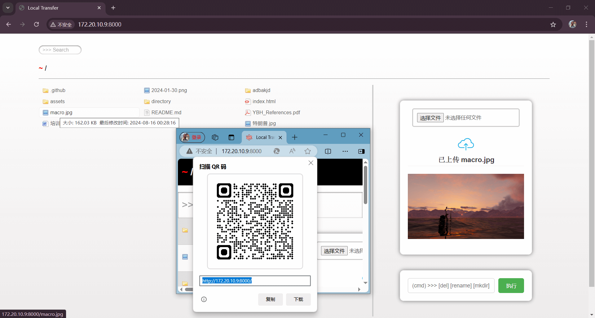
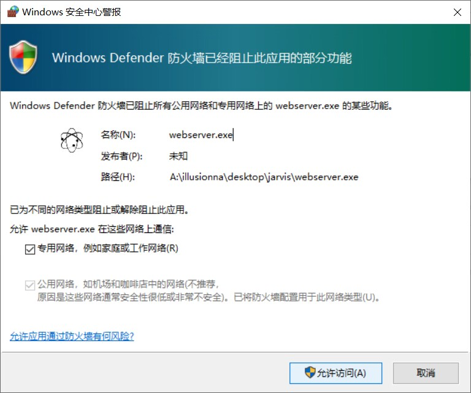
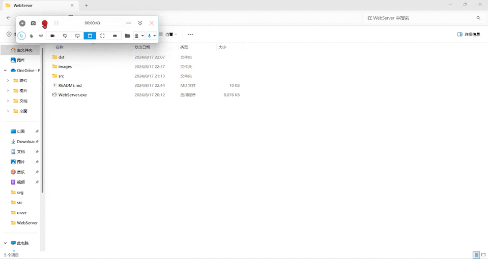
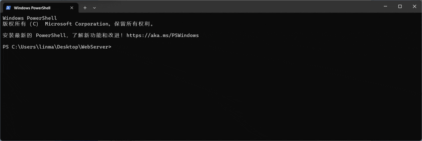
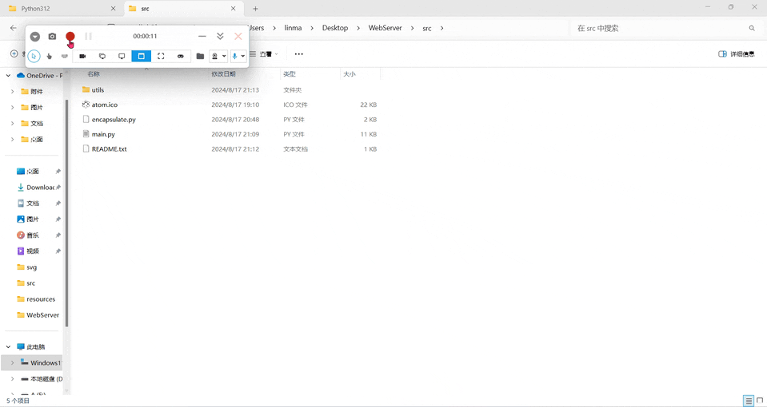
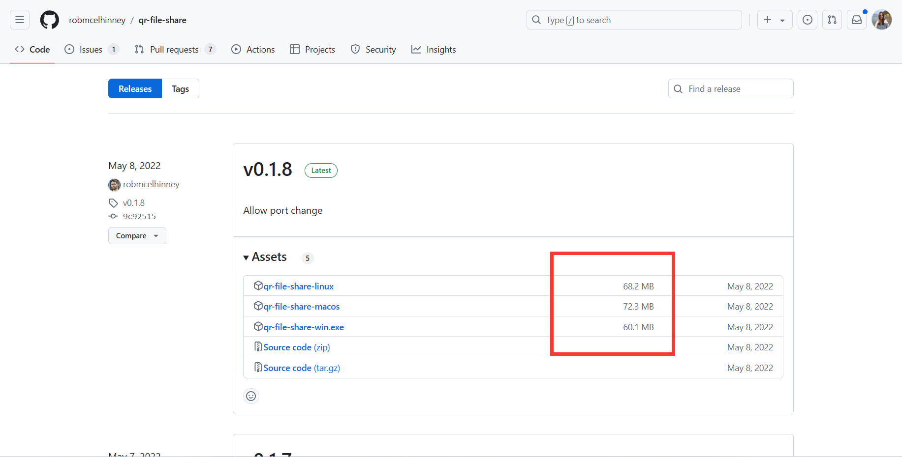
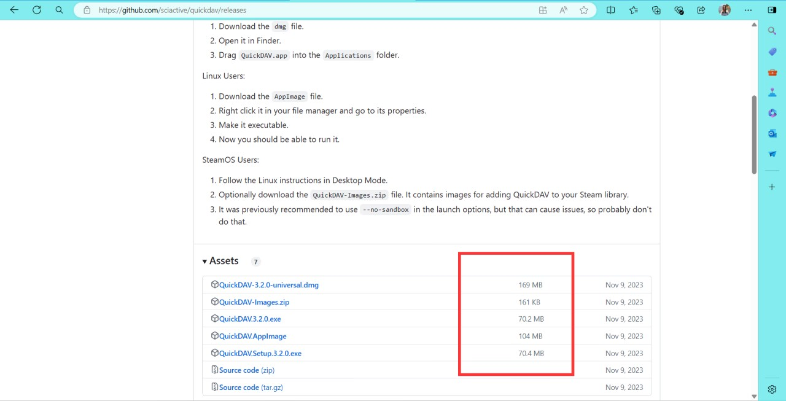
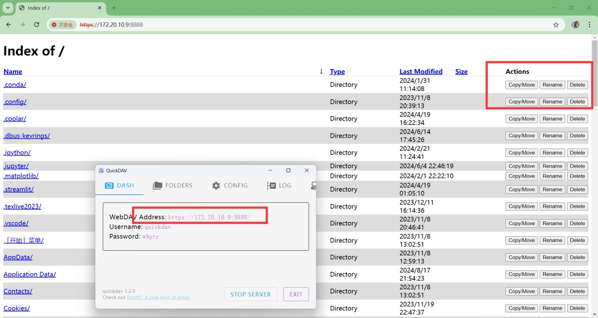

> 工具主页：https://illusionna.github.io/LocalTransfer
>
> bilibili 教学指南：https://www.bilibili.com/video/BV1MaDuY6EDJ

<h1 align="center">
	<a href="https://illusionna.github.io/LocalTransfer.github.io" target="_blank">
	</a>
    <br>
    <a style="color: #008000;"><b>Local Transfer</b></a>
</h1>

<h4 align="center">一个<a style="color: red;">傻瓜式</a>操作的微型<a style="color: red;">文件传输</a>服务器 | <a href="https://www.orzzz.net" target="_blank">Illusionna</a></h4>

<p align="center">
    <a href="https://www.python.org" rel="nofollow" target="_blank">
        
    </a>
    <a href="https://www.gnu.org/licenses/gpl-3.0.en.html" rel="nofollow" target="_blank">
        
    </a>
</p>
<blockquote align="center">
    Local Transfer 提供开箱即用的 <strong>WebServer.exe</strong> 非代码工具
    <br>
    Local Transfer 致力于<strong>局域网</strong>文件传输但<strong>不限于此</strong>
    <br>
    Local Transfer 最大的特点：<strong>便捷</strong>、<strong>跨设备</strong>
</blockquote>
<p align="center">
    <a href="#简介">简介</a>
    |
    <a href="https://github.com/Illusionna/LocalTransfer" target="_blank">快速开始</a>
</p>

------

> 如果 README.md 里面的 .gif 图看不清楚, 可以去 images 文件夹里找高清 .mp4 教学视频演示。

## 0. 目录

1. Star History
2. 示例截图
3. 介绍
4. 环境配置
5. 如何使用？
	- WebServer.exe
	- Code
6. 内网穿透
7. 源码结构树
8. 版本
9. 开源致谢
10. 同步

------


## 1. Star History

[](https://star-history.com/#Illusionna/LocalTransfer&Date)

## 2. 示例截图

`iPad 设备`和启动服务器的`电脑`连接在同一个 WiFi 热点下，在 iPad 浏览器输入服务网址（类似 https://172.168.10.9:8080）或扫描二维码（Edge 浏览器右击选择创建页面二维码）即可进入共享文件夹目录。



<video controls>
    <source src="./images/macOS-demo.mp4" type="video/mp4">
</video>

<video controls>
    <source src="./images/Linux-demo.mp4" type="video/mp4">
</video>


## 3. 介绍

“哥们，快把最新的游戏安装包发我一份，好哥哥，顺便把这周作业也发我。”

“兄弟，QQ 显示安装包过大，传送失败，乐，作业说有敏感词汇，也发不出去。”

“哥们你用 U 盘。”

“去哪借？”

“你......🙂”

你是否经常跨设备互传文件？是否遇到过文件太大传输失败？

`Local Transfer` 是一个开源免费的微型文件传输服务器工具，支持对服务器的一定操作，它具备便携、中心化以及跨平台特点，适合局域网内**`快速`**共享文件。

## 4. 环境配置

> 若不想配置代码运行环境依赖，可以直接使用封装好的 [`WebServer.exe`](https://github.com/Illusionna/LocalTransfer/releases) 文件，双击程序或者终端执行。

<details>
<summary><b>4.1. WebServer.exe</b></summary>


<p align="center">
    <a href="https://www.microsoft.com" rel="nofollow" target="_blank">
        
    </a>
</p>
二进制可执行程序需要在 Windows 环境下运行，建议 10 以及 11 版本，若在 Linux 操作系统下，可以使用 wine 工具，但建议使用 Code 源码运行。

</details>

<details>
<summary><b>4.2. Code</b></summary>

<p align="center">
    <a href="https://unix.org" rel="nofollow" target="_blank">
        
    </a>
    <a href="https://www.python.org" rel="nofollow" target="_blank">
        
    </a>
    <a href="https://flask.palletsprojects.com" rel="nofollow" target="_blank">
        
    </a>
</p>
源码执行需要 Python 环境以及 flask 库，但我已经帮你配置好环境依赖，你可以进入 src 源码文件夹，执行类似这样的命令【请使用绝对路径】，立刻运行✌：

```
>>> python A:/Illusionna/Desktop/LocalTransfer/src/main.py
```

</details>

## 5. 如何使用？

高级使用见：

> [Local Transfer (Illusionna.github.io)](https://Illusionna.github.io/LocalTransfer.github.io)
>
> [https://orzzz.net](https://www.orzzz.net)

以下是基本使用，超级简单。

一、确保`不要被`杀毒软件`误杀`哟 ~


二、确保网络防火墙允许 Local Transfer 接入`同一个` WiFi 或热点下的`局域网` : )




### 5.1. `WebServer.exe`

请注意，一共有三种发行版，`WebServer.exe`、`./WebServerFull/WebServer.exe`、`./WebServerLite/WebServer.exe`，作者推荐 `WebServer.exe` 单文件。

- `双击`：下载好 `WebServer.exe` 后，放在你的软件文件夹里，`直接双击`运行程序，当然，可以在桌面上创建一个`快捷方式`，或者加到`环境变量`。




- `终端`：对于高级选项功能操作，可在 Windows cmd `命令提示符`使用指令查看 help 文档。

    ```
    >>> WebServer.exe  --h
    ```

    - 查看工具版本以及其他信息
    
        ```
        >>> WebServer.exe  --v
        ```
        
    - 
    
    - 修改共享文件夹路径（若文件夹不存在，返回 404，`默认桌面`）
    
        ```
        >>> WebServer.exe  -share  A:/orzzz/net
        ```
    
    - 修改上传文件夹路径（若文件夹不存在，返回 404，`默认桌面`）
    
        ```
        >>> WebServer.exe  -upload  A:/Illusion/cache
        ```
    
    - 既修改 IPv4 又修改端口号
    
        ```
        >>> WebServer  -host  127.0.0.1  -port  12345
        ```


### 5.2. `Code`

一、零门槛直接上手（使用绝对路径）

```
cd A:/Illusionna/Desktop/LocalTransfer/src
```

```
python A:/Illusionna/Desktop/LocalTransfer/src/main.py
```



二、POST 请求 Local Transfer API

```
# 上传某个文件到服务器.
>>> curl -X POST -F "./RANDOM=@/Users/illusionna/cat.png" http://192.168.1.103:8888/POST-API
```

三、从头开始（附带打包 exe 程序）

```
>>> cd A:/Illusionna/Desktop/LocalTransfer/src
```

```
>>> conda create -n LocalTransfer python==3.7.0
```

```
>>> conda activate LocalTransfer
```

```
>>> python -m venv venv
```

```
>>> ./venv/Scripts/activate
```

```
>>> conda deactivate
```

```
>>> ./venv/Scripts/pip.exe install flask==2.2.5
```

```
>>> ./venv/Scripts/python.exe  A:/Illusionna/Desktop/LocalTransfer/src/main.py
```

```
>>> CTRL + C
```

```
>>> ./venv/Scripts/pip.exe install pyinstaller
```

```
>>> ./venv/Scripts/python.exe  ./encapsulate.py
```

## 6. 内网穿透

出门在外没带电脑，突然要紧急发送桌面的“project”项目文件夹给别人？

发现“paper.pdf”有很明显的错别字，需要远程接入电脑重新排版？


Local Transfer 是局域网文件传输工具，但同时支持互联网公网访问，仅需简单的内网穿透，即可远程连接。例如下载 [cpolar.exe](https://www.cpolar.com) 内网穿透工具，用 cpolar 映射到 WebServer 套接字，打开两个终端分别执行：

```
>>> WebServer.exe
```

```
>>> cpolar  http  192.xxx.xxx.xxx  8080
```

## 7. 源码结构树

<details>
<summary><b>展开</b></summary>

    卷 Windows11 的文件夹 PATH 列表
    卷序列号为 D44F-BE99
    C:.
    
    │  README.md	(注意说明请阅读我)
    │  WebServer.exe	(单文件 Local Transfer 服务器工具, 第一发行版)
    │  
    ├─dst	(最终结果目标文件夹)
    │  ├─WebServerFull	(Local Transfer 完整版)
    │  │  │  api-ms-win-core-console-l1-1-0.dll
    │  │  │  ..........................
    │  │  │  base_library.zip
    │  │  │  VCRUNTIME140.dll
    │  │  │  WebServer.exe	(打包的完整版服务器工具, 第二发行版)
    │  │  │      
    │  │  └─resources	(完整版的 WebServer.exe 依赖静态资源包)
    │  │      │  commands.json	(自定义指令集)
    │  │      │  
    │  │      ├─bin	(Local Transfer 附带的二进制执行程序)
    │  │      │      GluttonousSnake.exe	(贪吃蛇)
    │  │      │      HelloWorld.exe	(第一个 C 语言程序)
    │  │      │      unzip.exe	(解压 zip 指令工具)
    │  │      │      zip.exe	(打包 zip 指令工具)
    │  │      │      
    │  │      ├─static	(第一个 C 语言源码)
    │  │      │      HelloWorld.c
    │  │      │      
    │  │      └─templates	(WebServer 给前端渲染的模板)
    │  │              couple404.html
    │  │              ghost404.html
    │  │              index.html	(首索引网页文件)
    │  │              screen500.html
    │  │              unicorn500.html
    │  │              
    │  └─WebServerLite	(Local Transfer 精简版, 完整版的简化)
    │          base_library.zip
    │          unicodedata.pyd
    │          WebServer.exe	(精简版的服务器工具, 第三发行版)
    │          _asyncio.pyd
    │          _bz2.pyd
    │		   .............
    │          _socket.pyd
    │          
    ├─images	(README.md 依赖的图像文件夹)
    │      base.mp4
    │      bloated1.png
    │      .......................................
    │      win11.png
    │      Windows-x64-brightgreen.svg
    │          
    └─src	(Local Transfer 源代码)
        │  atom.ico	(图标)
        │  encapsulate.py	(封装可执行程序代码)
        │  main.py	(程序入口文件)
        │  README.txt	(请先阅读代码说明文件)
        │  
        └─utils	(自定义工具库)
            │  build.py	(构建 Local Transfer 各种依赖文件)
            │  HEXADECIMAL_DATA.py	(十六进制数据资源文件)
            │  parse.py		(解析器文件)
            │  tool.py		(工具器文件)
            │  
            └─site-packages	(Python 第三方库)
                │  typing_extensions.py
                ├─bin
                ├─click
                ├─colorama
                ├─flask
                │  │  cli.py
                │  │  .........
                │  └─json
                │       |   provider.py
                │       |   tag.py
                │       |   __init__.py 
                ├─markupsafe
                ├─werkzeug
                │  │  serving.py
                │  │  .............
                │  │  __init__.py
                │          
                └─zipp
                     |   py310compat.py
                     |   __init__.py

</details>

## 8. 版本

```
>>> WebServer  --v
```

> [Releases · Illusionna/LocalTransfer (github.com)](https://github.com/Illusionna/LocalTransfer/releases)

## 9. 开源致谢

> https://flask.palletsprojects.com
>
> https://github.com/tapio/live-server
>
> https://flask-autoindex.readthedocs.io







## X. 同步

> https://www.orzzz.net
>
> https://github.com/Illusionna/LocalTransfer
>
> https://Illusionna.github.io/LocalTransfer.github.io
