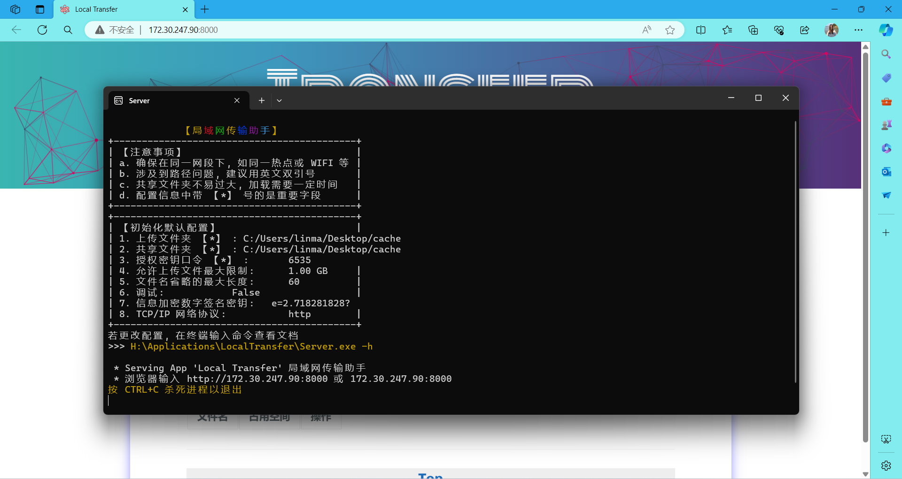
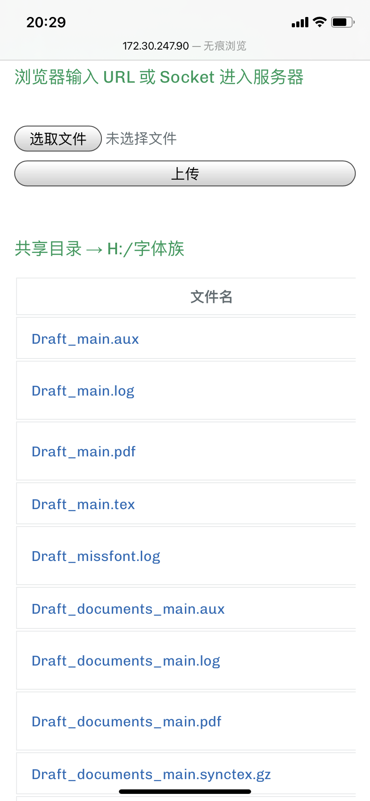
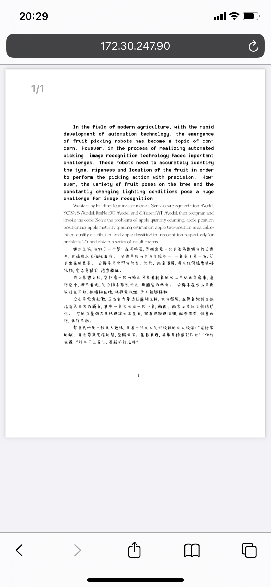

# LocalTransfer

A repository for LocalTransfer.

כל המקיים נפש אחת מעלין עליו כאילו קיים עולם מלא

[TOC]

# 简介

工具主页：[Local Transfer (Illusionna.github.io)](https://Illusionna.github.io/LocalTransfer.github.io)

## 功能

这是一个局域网内文件传输悍匪，致力于跨平台多设备之间文件共享。它需要一台电脑当作服务器，其余电子设备如计算机、手机、平板、手表等，通过局域网 WIFI 或热点接入服务器后，即可跨平台互传文件。

它的优点在于零门槛，适合广泛的人群，并且文件传输速度取决于网络带宽，而一般局域网内部，传文件速度是相当快的。但 Local Transfer 是自制工具，因此可能会被误杀，确保防火墙允许“悍匪”进入你的网络 (●ˇ∀ˇ●).

## 演示视频

<video src="./imgs/demo.mp4"></video>

## 使用截图







# 使用

确保所有电子设备在同一个局域网下，你和朋友需要连接同一个 WIFI 或设备热点。

## 源码运行

```
代码主页：https://github.com/Illusionna/LocalTransfer
```

```
>>> curl https://github.com/Illusionna/LocalTransfer/archive/refs/heads/main.zip -o main.zip
```

```python
建议 Windows 10 + 以及 Python 3.8.0 +
```

```python
>>> pip install flask
```

```
然后阅读 main.py 开头对 secure_filename() 函数的编码修改，当然，你也可以忽略它。
```

```python
>>> python main.py
```

## 可执行程序

- 工具主页：[Local Transfer (Illusionna.github.io)](https://Illusionna.github.io/LocalTransfer.github.io)

- 下载发行版：[Release Local Transfer (Windows 10 +) · Illusionna/LocalTransfer (github.com)](https://github.com/Illusionna/LocalTransfer/releases/tag/V1)

- 确保是 Windows 10 + 并且防火墙和杀毒软件不要误杀程序

- **<u>直接双击程序或快捷方式运行</u>**，零门槛

- 或者选择终端配置相关参数后再执行，查看帮助文档指令

  ```
  >>> server.exe -h
  ```

## 内网穿透

虽然这是局域网共享文件的工具，但它支持内网穿透，你可以通过穿透让全世界公网的朋友们都接入你的服务器。但相比局域网速度快不消耗流量的优势，外网访问速度会大幅度下降并且消耗流量，不过，如果你需要远程共享文件，这也是一个很棒的措施，这里内网穿透工具使用的是 cpolar.exe，你可以去它官网下载。

```
如果是源码运行
	step 1 >>> python main.py
	step 2 >>> cpolar http "第一步终端的 socket 套接字"
			例如 >>> cpolar  http  172.168.30.222:8000
```

```
如果是可执行程序运行
	step 1 >>> server.exe	(或者直接双击程序快捷方式)
	step 2 >>> cpolar http "第一步终端的 socket 套接字"
```

