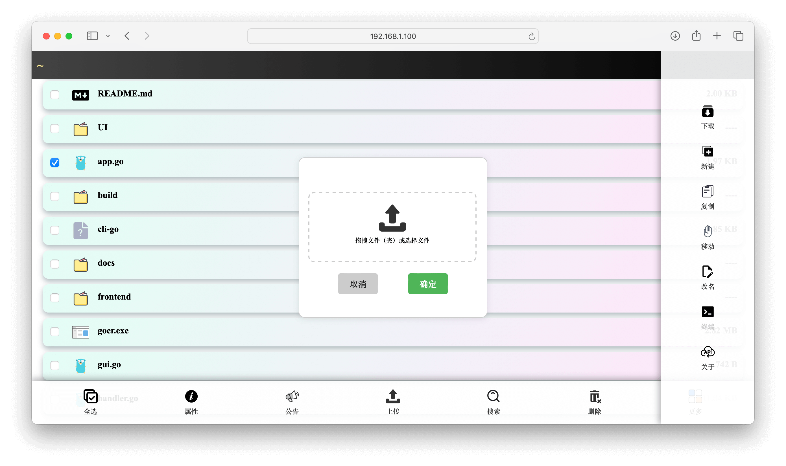
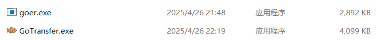
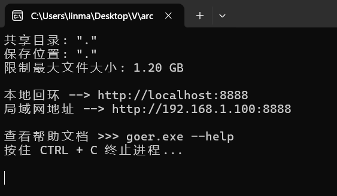

<h1 align="center">
    <a href="https://github.com/Illusionna/LocalTransfer" target="_blank">
    </a>
    <br>
    <a style="color: #008000;"><b>Go Local Transfer</b></a>
</h1>

<h4 align="center">一个快速上手的跨平台 HTTP 文件服务器 | <a href="https://www.orzzz.net" target="_blank">@Illusionna</a></h4>

## 截图

<div align=center>
    
</div>

## 简介

Go Local Transfer 是一个 HTTP 文件服务器，具备图形化界面，支持 Windows、Linux、macOS 三种操作系统，可用于局域网（或互联网）文件传输。

## 使用

在 [Releases](https://github.com/Illusionna/LocalTransfer/releases) 发行版下载相应的压缩包，解压后得到 GoTransfer 和 goer 两个程序。GoTransfer 是 GUI 图形化软件，goer 是 CLI 终端命令行程序，可根据自己的需要执行其中任意一个即可。

<div align=center>
    
</div>

> 双击 GoTransfer 软件

<div align=center>
    
</div>

> 终端执行 goer 程序

<div align=center>
    
</div>

## 编译

> 运行环境：Golang 1.23.0、Wails 2.10.0、Nodejs 20.12.2、64 位操作系统

下载仓库代码：

```
git clone https://github.com/Illusionna/LocalTransfer.git
```

仓库代码默认构建 GUI 图形化软件，在终端依次执行指令：

```
go mod init GoTransfer
go mod tidy
wails build
```

输出的二进制可执行程序在 `./build/bin` 目录。

除此之外，若想构建 CLI 命令行程序，先删除 `gui.go` 文件（或重命名为 `gui.py` emmmm 随便一个非 go 文件的名字就行啦），然后创建一个名为 `cli.go` 的文件，并将如下代码粘贴进去：

```go
package main

import (
	"os"
	"fmt"
	"flag"
	"net/http"
	"path/filepath"
)

var __HOST_IPv4 = flag.String("ip", GetLocalIPv4Addresses(), "")
var __HOST_PORT = flag.String("port", "8888", "")
var __SHARE_DIR = flag.String("share", ".", "")
var __UPLOAD_DIR = flag.String("save", *__SHARE_DIR, "")
var __MAX_SIZE = flag.String("max", "1.2 GB", "")
var __LOGIN_PASSWORD = flag.String("login", "", "")
var __VERSION = flag.Bool("version", false, "")

func main() {
	flag.Usage = func() {
		fmt.Printf("命令行示例\n")
		fmt.Printf("    e.g. 共享文件夹, 且限制最大文件大小, 程序放行在主机端口\n")
		fmt.Printf(`        >>> %s -share "C:\Users\Zolio Marling\Desktop" -max "36 MB" -port 443`, filepath.Base(os.Args[0]))
		fmt.Printf("\n\n")
		fmt.Printf("全部参数解释\n")
		fmt.Printf("    -version\n        查看软件版本及其他信息\n")
		fmt.Printf("    -ip (string)\n        服务器 IPv4 地址 (默认 \"%s\")\n", *__HOST_IPv4)
		fmt.Printf("    -port (string)\n        服务运行的端口号 (默认 \"%s\")\n", *__HOST_PORT)
		fmt.Printf("    -share (string)\n        想要共享出去的文件夹路径 (默认 \"%s\" 当前工作目录)\n", *__SHARE_DIR)
		fmt.Printf("    -save (string)\n        上传的文件保存到的位置 (默认 \"%s\" 与共享目录路径相同)\n", *__UPLOAD_DIR)
		fmt.Printf("    -max (string)\n        限制上传文件的最大尺寸 (默认 \"%s\")\n", *__MAX_SIZE)
		fmt.Printf("    -login (string)\n        前端登录密码 (默认 \"%s\" 为空不需要登录)\n", *__LOGIN_PASSWORD)
	}

	flag.Parse()

	if *__VERSION {
        fmt.Println("Go Local Transfer App v5")
		fmt.Println("协议: MIT License")
		fmt.Println("作者: @Illusionna")
		fmt.Println("隶属: Jarvis Engineering Tool")
		fmt.Println("仓库: https://github.com/Illusionna/LocalTransfer")
		fmt.Println("主页: https://orzzz.net")
		fmt.Println("邮箱: www@orzzz.net")
        os.Exit(0)
	}

	HOST_IPv4 = *__HOST_IPv4
	HOST_PORT = *__HOST_PORT
	SHARE_DIR = *__SHARE_DIR
	UPLOAD_DIR = *__UPLOAD_DIR
	MAX_SIZE = *__MAX_SIZE
	LOGIN_PASSWORD = *__LOGIN_PASSWORD

	fmt.Printf("共享目录: \"%s\"\n", SHARE_DIR)
	fmt.Printf("保存位置: \"%s\"\n", UPLOAD_DIR)
	fmt.Printf("限制最大文件大小: %s\n", ConvertStorageUnit(ParseStorageUnit(MAX_SIZE)))
	if LOGIN_PASSWORD != "" { fmt.Printf("登录密码: \"%s\"\n", LOGIN_PASSWORD) }
	fmt.Println("")
	fmt.Printf("本地回环 --> http://localhost:%s\n", HOST_PORT)
	fmt.Printf("局域网地址 --> http://%s:%s\n", HOST_IPv4, HOST_PORT)
	fmt.Println("")
	fmt.Printf("查看帮助文档 >>> %s --help\n", filepath.Base(os.Args[0]))
	fmt.Printf("按住 CTRL + C 终止进程...\n\n")

	RegisterRouter()

	http.ListenAndServe(":" + HOST_PORT, nil)
}
```

然后在终端执行指令即可构建 CLI 命令行工具。

```
go build -o goer.exe -ldflags="-s -w" cli.go types.go handler.go utils.go
```

## 趋势

[](https://star-history.com/#Illusionna/LocalTransfer&Date)

## 开源致谢

谢谢我就好啦~ 如果该项目帮助到你，欢迎给我点赞！🤭
