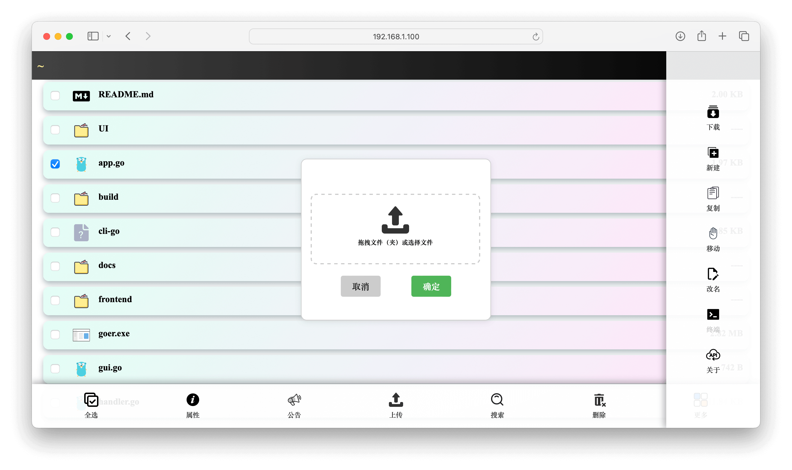
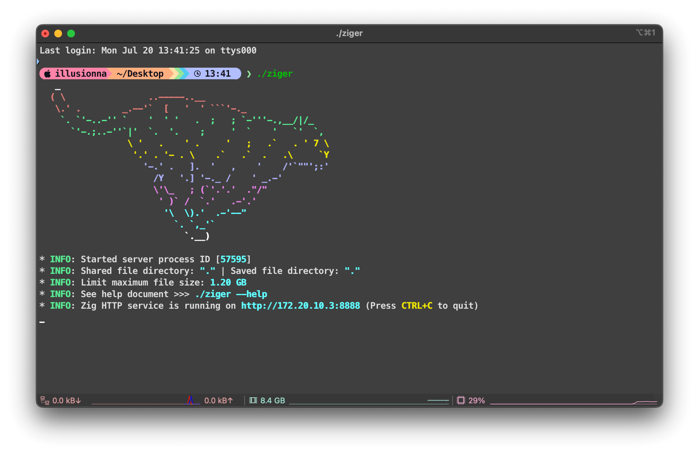

<h1 align="center">
    <a href="https://github.com/Illusionna/LocalTransfer" target="_blank">
    </a>
    <br>
    <a style="color: #008000;"><b>Zig Local Transfer</b></a>
</h1>

<h4 align="center">一个快速上手的跨平台 HTTP 文件服务器 | <a href="https://www.orzzz.net" target="_blank">@Illusionna</a></h4>

## 截图

<div align=center>
    
</div>

## 简介

Zig Local Transfer 是一个 HTTP 文件服务器，具备图形化界面，支持 Windows、Linux、macOS 三种操作系统，可用于局域网（或互联网）文件传输。

## 使用

在 [**`Releases`**](https://github.com/Illusionna/LocalTransfer/releases) 下载相应系统对应的发行版，终端执行 CLI 命令行程序。

> 终端执行 **`ziger`** 程序

<div align=center>
    
</div>

## 编译

> 运行环境：`Ziglang 0.16.0`、操作系统 `64` 位

```sh
zig version
```

下载仓库代码：

```sh
git clone --depth 1 https://github.com/Illusionna/LocalTransfer.git
```

编译可执行文件：

```sh
make
```

## Docker 部署

> 拉取镜像

```sh
docker pull illusionna/localtransfer-amd64:latest
```

> 使用镜像

```sh
docker run \
    --rm -it \
    -p 8888:8888 \
    -v "$PWD:/share" \
    -v "$PWD:/store" \
    illusionna/localtransfer-amd64:latest \
        --share /share \
        --store /store \
        --login '123456'
```

> 构建镜像

```sh
make docker-amd64
make docker-arm64
```

## 开源致谢

谢谢我就好啦~ 如果该项目帮助到你，欢迎给我点赞！🤭
