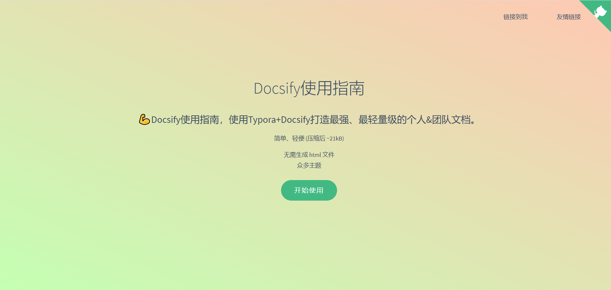
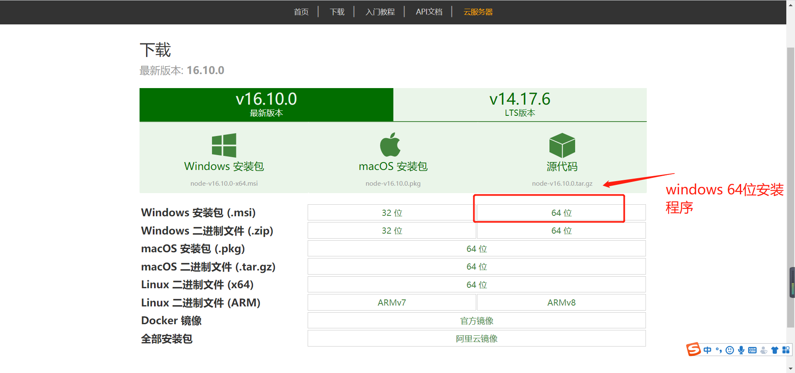
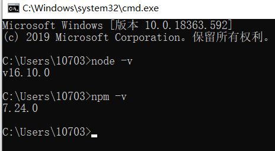
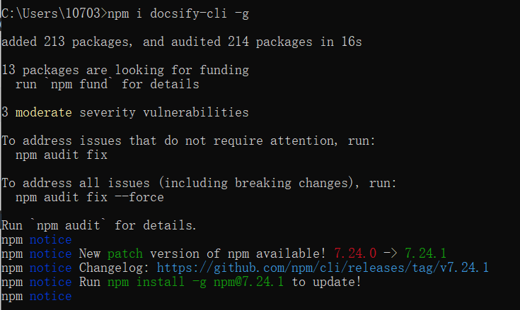
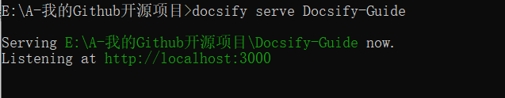
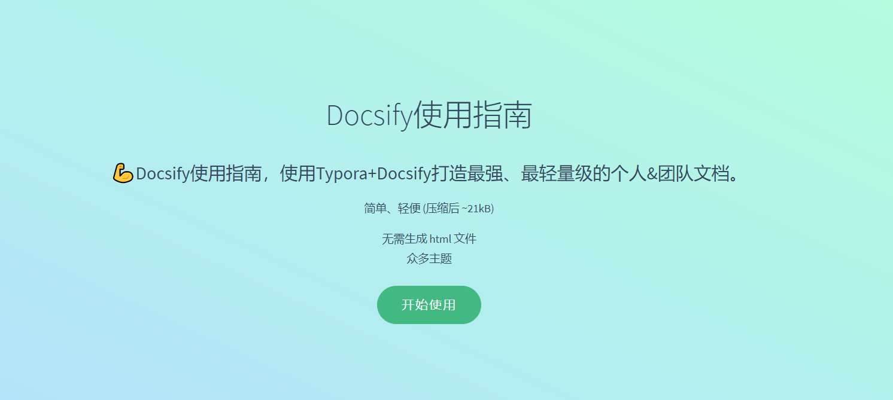
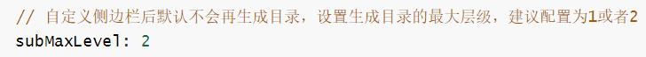
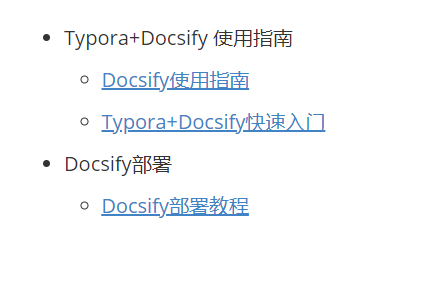
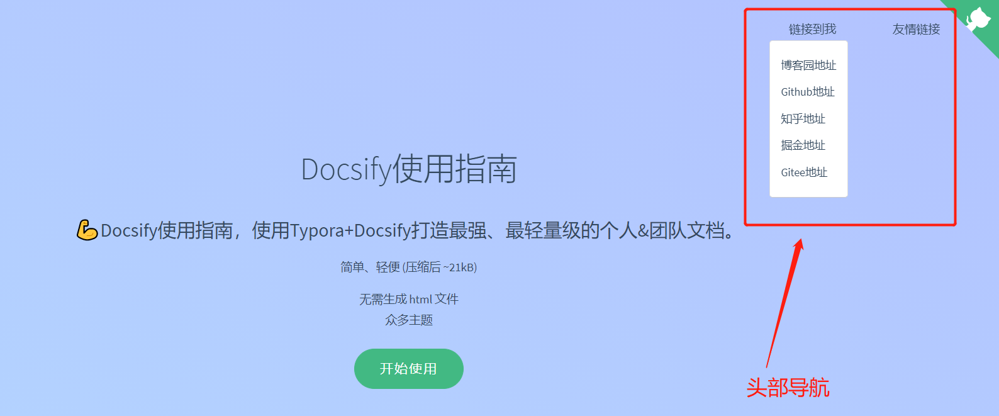

## Docsify使用指南



## Node.js 安装配置

* [nodejs下载地址](http://nodejs.cn/download/)

* [Node.js最新最详细安装教程](https://blog.csdn.net/Small_Yogurt/article/details/104968169)



win+r：cmd进入命令提示符窗口，分别输入以下命令查看node和npm的版本能够正常显示版本号，则安装成功：

- node -v：显示安装的nodejs版本
- npm -v：显示安装的npm版本




## docsify-cli工具安装

> 推荐全局安装 `docsify-cli` 工具，可以方便地创建及在本地预览生成的文档。

``` javascript
npm i docsify-cli -g
```




## 项目初始化

> 如果想在项目的 `./docs(文件名可以按自己的想法来)` 目录里写文档，直接通过 `init` 初始化项目。

``` javascript
docsify init ./Docsify-Guide
```


初始化成功后，可以看到 `./docs` 目录下创建的几个文件

- `index.html` 入口文件
- `README.md` 会做为主页内容渲染
- `.nojekyll` 用于阻止 GitHub Pages 忽略掉下划线开头的文件

直接编辑 `docs/README.md` 就能更新文档内容，当然也可以[添加更多页面](https://docsify.js.org/#/zh-cn/more-pages)。


## 本地运行docsify创建的项目

> 通过运行 `docsify serve 项目名称 ` 启动一个本地服务器，可以方便地实时预览效果。默认访问地址 [http://localhost:3000](http://localhost:3000/) 。

``` javascript
docsify serve Docsify-Guide
```



## Linux下后台部署项目
在Linux下如果使用下面的命令启动docsify，会发现一旦关闭了xShell，那么就访问不了了，具体问题还不清楚，下面说种可以在后台运行的方法；
```shell
nohup docsify serve 项目地址 --port=80 > /dev/null 2>&1 &
```
通过编写shell脚本，将上面代码放到脚本里面，再启动就可以了；    
1、创建脚本：vim start_docsify.sh
```shell
#! bin/bash
nohup docsify serve 项目地址 --port=80 > /dev/null 2>&1 &
```
2、启动脚本
```shell
bash start_docsify.sh
```

## 基础配置文件介绍

> 其实我们维护一份轻量级的个人&团队文档我们只需要配置以下这几个基本文件就可以了。

|        文件作用        |     文件      |
| :--------------------: | :-----------: |
| 基础配置项（入口文件） |  index.html   |
|      封面配置文件      | _coverpage.md |
|     侧边栏配置文件     |  _sidebar.md  |
|     导航栏配置文件     |  _navbar.md   |
|    主页内容渲染文件    |   README.md   |
|       浏览器图标       |  favicon.ico  |


## 基础配置项（index.html）

> 下面是一份基础的配置项模板如下(可直接Copy使用)。

``` html
<!DOCTYPE html>
<html lang="en">

<head>
    <meta charset="UTF-8">
    <title>Docsify-Guide</title>
    <meta http-equiv="X-UA-Compatible" content="IE=edge,chrome=1" />
    <meta name="description" content="Description">
    <meta name="viewport"
        content="width=device-width, user-scalable=no, initial-scale=1.0, maximum-scale=1.0, minimum-scale=1.0">
    <!-- 设置浏览器图标 -->
    <link rel="icon" href="/favicon.ico" type="image/x-icon" />
    <link rel="shortcut icon" href="/favicon.ico" type="image/x-icon" />
    <!-- 默认主题 -->
    <link rel="stylesheet" href="//cdn.jsdelivr.net/npm/docsify/lib/themes/vue.css">
</head>

<body>
    <!-- 定义加载时候的动作 -->
    <div id="app">加载中...</div>
    <script>
        window.$docsify = {
            // 项目名称
            name: 'Docsify-Guide',
            // 仓库地址，点击右上角的Github章鱼猫头像会跳转到此地址
            repo: 'https://github.com/YSGStudyHards',
            // 侧边栏支持，默认加载的是项目根目录下的_sidebar.md文件
            loadSidebar: true,
            // 导航栏支持，默认加载的是项目根目录下的_navbar.md文件
            loadNavbar: true,
            // 封面支持，默认加载的是项目根目录下的_coverpage.md文件
            coverpage: true,
            // 最大支持渲染的标题层级
            maxLevel: 5,
            // 自定义侧边栏后默认不会再生成目录，设置生成目录的最大层级（建议配置为2-4）
            subMaxLevel: 4,
            // 小屏设备下合并导航栏到侧边栏
            mergeNavbar: true,
        }
    </script>
    <script>
        // 搜索配置(url：https://docsify.js.org/#/zh-cn/plugins?id=%e5%85%a8%e6%96%87%e6%90%9c%e7%b4%a2-search)
        window.$docsify = {
            search: {
                maxAge: 86400000,// 过期时间，单位毫秒，默认一天
                paths: auto,// 注意：仅适用于 paths: 'auto' 模式
                placeholder: '搜索',
                // 支持本地化
                placeholder: {
                    '/zh-cn/': '搜索',
                    '/': 'Type to search'
                },
                noData: '找不到结果',
                depth: 4,
                hideOtherSidebarContent: false,
                namespace: 'Docsify-Guide',
            }
        }
    </script>
    <!-- docsify的js依赖 -->
    <script src="//cdn.jsdelivr.net/npm/docsify/lib/docsify.min.js"></script>
    <!-- emoji表情支持 -->
    <script src="//cdn.jsdelivr.net/npm/docsify/lib/plugins/emoji.min.js"></script>
    <!-- 图片放大缩小支持 -->
    <script src="//cdn.jsdelivr.net/npm/docsify/lib/plugins/zoom-image.min.js"></script>
    <!-- 搜索功能支持 -->
    <script src="//cdn.jsdelivr.net/npm/docsify/lib/plugins/search.min.js"></script>
    <!--在所有的代码块上添加一个简单的Click to copy按钮来允许用户从你的文档中轻易地复制代码-->
    <script src="//cdn.jsdelivr.net/npm/docsify-copy-code/dist/docsify-copy-code.min.js"></script>
</body>

</html>
```


## 封面配置文件（_coverpage.md）

> [Docsify官网封面配置教程](https://docsify.js.org/#/zh-cn/cover)

**index.html**

``` html
<!-- index.html -->

<script>
  window.$docsify = {
    coverpage: true
  }
</script>
<script src="//cdn.jsdelivr.net/npm/docsify/lib/docsify.min.js"></script>
```


**_coverpage.md**

``` markdown
<!-- _coverpage.md -->

# Docsify使用指南 

> 💪Docsify使用指南，使用Typora+Docsify打造最强、最轻量级的个人&团队文档。

 简单、轻便 (压缩后 ~21kB)
- 无需生成 html 文件
- 众多主题


[开始使用 Let Go](/README.md)
```



## 侧边栏配置文件（_sidebar.md）

> [Docsify官网配置侧边栏教程](https://docsify.js.org/#/zh-cn/more-pages?id=%e5%ae%9a%e5%88%b6%e4%be%a7%e8%be%b9%e6%a0%8f)

**index.html**

``` html
<!-- index.html -->

<script>
  window.$docsify = {
    loadSidebar: true
  }
</script>
<script src="//cdn.jsdelivr.net/npm/docsify/lib/docsify.min.js"></script>
```

> 在index.html基础配置文件中设置了二级目录



**_sidebar.md**

``` markdown
<!-- _sidebar.md -->

* Typora+Docsify使用指南
  * [Docsify使用指南](/ProjectDocs/Docsify使用指南.md) <!--注意这里是相对路径-->
  * [Typora+Docsify快速入门](/ProjectDocs/Typora+Docsify快速入门.md)
* Docsify部署
  * [Docsify部署教程](/ProjectDocs/Docsify部署教程.md)

```



## 导航栏配置文件（_navbar.md）

> [Docsify官网配置导航栏教程](https://docsify.js.org/#/zh-cn/custom-navbar?id=%e9%85%8d%e7%bd%ae%e6%96%87%e4%bb%b6)

**index.html**

``` html
<!-- index.html -->

<script>
  window.$docsify = {
    loadNavbar: true
  }
</script>
<script src="//cdn.jsdelivr.net/npm/docsify/lib/docsify.min.js"></script>
```


**_navbar.md**

``` markdown
<!-- _navbar.md -->

* 链接到我
  * [博客园地址](https://www.cnblogs.com/Can-daydayup/)
  * [Github地址](https://github.com/YSGStudyHards)
  * [知乎地址](https://www.zhihu.com/people/ysgdaydayup)
  * [掘金地址](https://juejin.cn/user/2770425031690333/posts)
  * [Gitee地址](https://gitee.com/ysgdaydayup)


* 友情链接
  * [Docsify](https://docsify.js.org/#/)
  * [博客园](https://www.cnblogs.com/)


```




## 全文搜索 - Search

[全文搜索 - Search](https://docsify.js.org/#/zh-cn/plugins?id=全文搜索-search)


## Docsify主题切换

> 注意：切换主题只需要在根目录的index.html切换对应的主题css文件即可

https://docsify.js.org/#/zh-cn/themes


## 相关教程

* [docsify-github地址](https://github.com/docsifyjs/docsify/#showcase)
* [docsify快速开始-官方教程](https://docsify.js.org/#/zh-cn/quickstart)
* [使用开源文档工具docsify，用写博客的姿势写文档](https://www.cnblogs.com/throwable/p/13605289.html)
* [Docsify使用指南（打造最强、最轻量级的个人&团队文档）](https://www.cnblogs.com/Can-daydayup/p/15413267.html)


