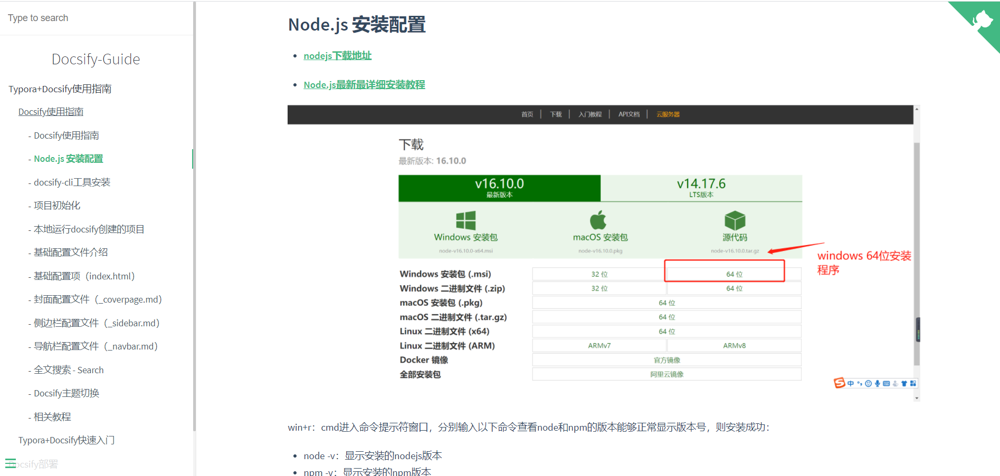

# Docsify-Guide
> 🐱‍🏍Docsify使用指南，使用Typora+Docsify打造最强、最快捷、最轻量级的个人&团队文档。

## Docsify使用教程
- [docsify-github地址](https://github.com/docsifyjs/docsify/#showcase)
- [docsify快速开始-官方教程](https://docsify.js.org/#/zh-cn/quickstart)
- [使用开源文档工具docsify，用写博客的姿势写文档](https://www.cnblogs.com/throwable/p/13605289.html)
- [Docsify使用指南（打造最强、最轻量级的个人&团队文档）](https://www.cnblogs.com/Can-daydayup/p/15413267.html)

## Docsify部署教程
- [Docsify部署IIS](https://www.cnblogs.com/Can-daydayup/p/15779788.html)
- [GitHub Pages](https://docsify.js.org/#/zh-cn/deploy?id=github-pages)
- [GitLab Pages](https://docsify.js.org/#/zh-cn/deploy?id=gitlab-pages)
- [Gitee Pages](https://docsify.js.org/#/zh-cn/deploy?id=gitee-pages)
- [Docker](https://docsify.js.org/#/zh-cn/deploy?id=docker)
- [Firebase 主机](https://docsify.js.org/#/zh-cn/deploy?id=firebase-主机)
- [VPS](https://docsify.js.org/#/zh-cn/deploy?id=vps)
- [Netlify](https://docsify.js.org/#/zh-cn/deploy?id=netlify)
- [ZEIT Now](https://docsify.js.org/#/zh-cn/deploy?id=zeit-now)
- [AWS Amplify](https://docsify.js.org/#/zh-cn/deploy?id=aws-amplify)
- [官方docsify部署教程](https://docsify.js.org/#/zh-cn/deploy)
- [30分钟使用Docsify+Github Pages搭建个人博客 ](https://www.cnblogs.com/Can-daydayup/p/15779888.html)

