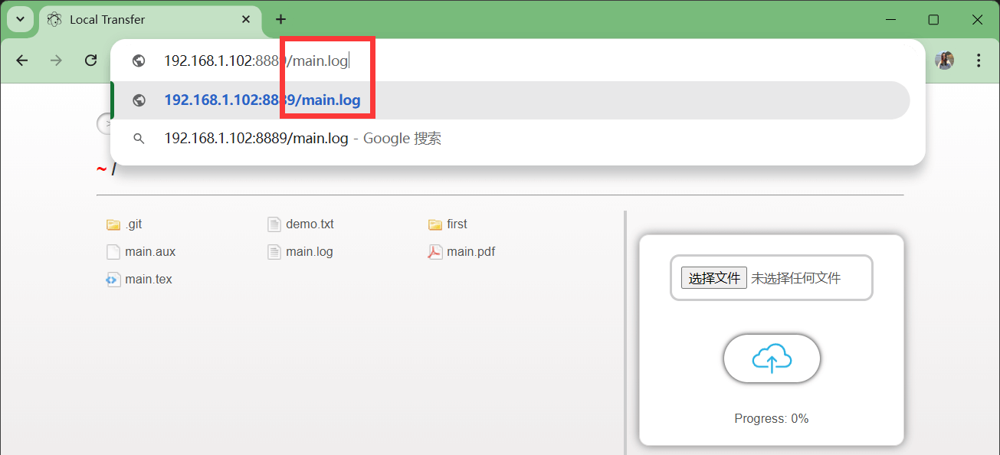
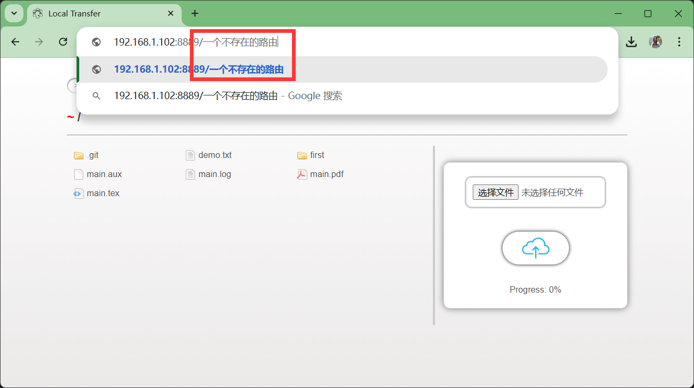
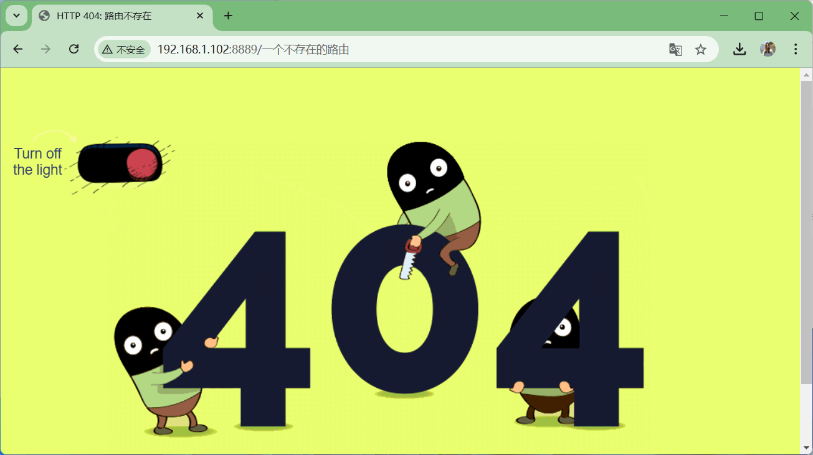
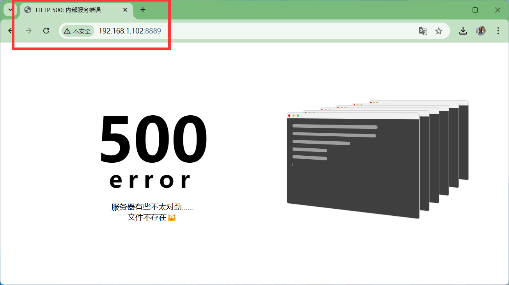
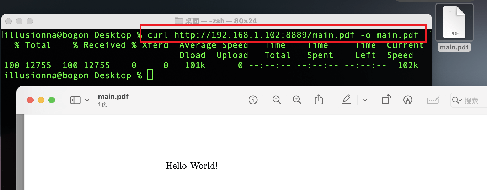
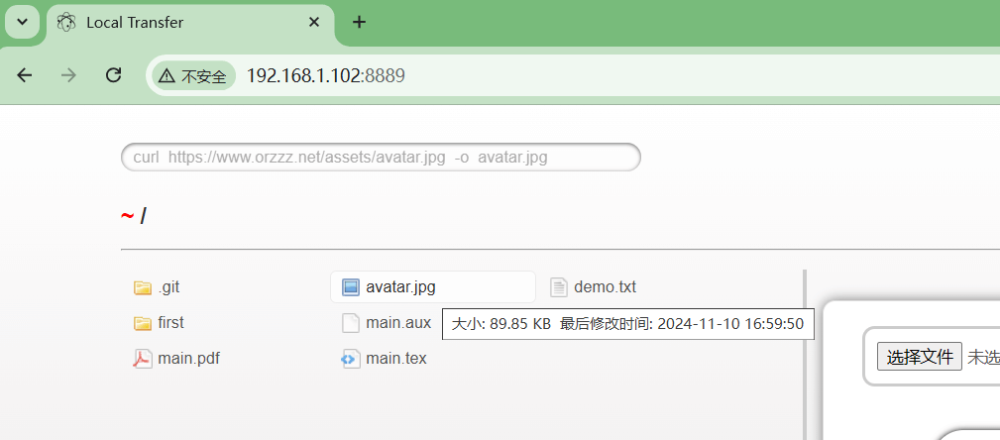

## 3.3.1. 发送 GET 请求

一般而言，最简单的方式是 "`GET`" 请求，终端使用者在浏览器地址栏显示地发送请求便可以下载文件，例如：

<div style="text-align: center;">
    
</div>

需要注意的是，如果误输入一个未知路由，那么 "`GET`" 请求是无效的，例如：

<div style="text-align: center;">
    
    
</div>

还有一种情形是，GET 请求找不到共享文件夹（或上传文件夹），例如，我共享 "`C:/Users/Illusionna/abc`" 文件夹，但是后端误删 "`abc`" 文件夹，或者把 "`abc`" 文件夹移动到其他位置，那么 "`GET`" 是无法下载文件的。

<div style="text-align: center;">
    
</div>

## 3.3.2. 使用 curl、wget 等工具

> "`curl`" 和 "`wget`" 都是非常优秀的终端工具，你可以分别在 https://curl.se 和 https://www.gnu.org/software/wget 下载，Local Transfer 的 "`commands.json`" 指令集自带 "`curl`" 和 "`wget`"。

> [!NOTE]
> 局域网内从 Local Transfer 服务器下载一份文件到本地电脑。
> ```zsh
> curl  http://192.168.1.102:8889/main.pdf  -o  main.pdf
> ```
> 或者使用 "`wget`" 工具也可。
> ```zsh
> wget  http://192.168.1.102:8889/main.pdf  -o  main.pdf
> ```

<div style="text-align: center;">
    
</div>

> [!NOTE]
> 在 Local Transfer 服务器上下载一张公网上的照片。【**首次下载完成后，记得清空 LRU 缓存，否则无法前端浏览器无法显示文件（但是可以 GET 请求该图片），见 “3.1.4. 清空 LRU 缓存”**】
> ```PowerShell
> curl  https://www.orzzz.net/assets/avatar.jpg  -o  avatar.jpg
> ```

<div style="text-align: center;">
    
</div>

## 3.3.3. 使用高级语言的请求库

除了使用 "`cURL`" 这样的工具，你也可以使用高级语言，比如 Python、C、Java 等，这样可以方便你操控服务器下载文件。

<div style="text-align: center;">
    
</div>

```python
# File:  DownloadPython.py
import requests

url = 'http://192.168.1.102:8889/avatar.jpg'
filename = 'avatar.jpg'

try:
    response = requests.get(url, stream=True)
    response.raise_for_status()     # 4xxx 或 5xxx.
    with open(filename, 'wb') as f:
        for chunk in response.iter_content(chunk_size=1024):
            f.write(chunk)
    print('成功.')
except requests.exceptions.RequestException as e:
    print(f'请求错误: {e}')
except Exception as e:
    print(f'未知错误: {e}')
```

> ```PowerShell
> python  DownloadPython.py
> ```

```java
// File:  DownloadJava.java

import java.io.BufferedInputStream;
import java.io.FileOutputStream;
import java.io.IOException;
import java.io.InputStream;
import java.net.URL;
import java.net.URLConnection;

public class DownloadJava {
    public static void main(String[] args) {
        String imageUrl = "http://192.168.1.102:8889/avatar.jpg";
        String destinationFile = "avatar.jpg";
        try {
            URL url = new URL(imageUrl);
            URLConnection connection = url.openConnection();
            connection.connect();
            int contentLength = connection.getContentLength();
            InputStream inputStream = new BufferedInputStream(connection.getInputStream());
            FileOutputStream outputStream = new FileOutputStream(destinationFile);
            byte[] dataBuffer = new byte[1024];
            int bytesRead;
            int totalBytesRead = 0;
            while ((bytesRead = inputStream.read(dataBuffer)) != -1) {
                outputStream.write(dataBuffer, 0, bytesRead);
                totalBytesRead += bytesRead;
            }
            outputStream.close();
            inputStream.close();
            System.out.println("Successfully.");
        } catch (IOException e) {
            System.err.println("Error: " + e.getMessage());
            e.printStackTrace();
        }
    }
}
```

> ```PowerShell
> javac  DownloadJava.java
> java  DownloadJava
> ```

```c
// File:  DownloadC.c

# include <stdio.h>
# include <curl/curl.h>

size_t write_data(void *ptr, size_t size, size_t nmemb, FILE *stream) {
    return fwrite(ptr, size, nmemb, stream);
}

int main(int argc, char* argv[], char** envs) {
    CURL *curl = curl_easy_init();
    FILE *fp = fopen("avatar.jpg", "wb");
    curl_easy_setopt(curl, CURLOPT_URL, "http://192.168.1.102:8889/avatar.jpg");
    curl_easy_setopt(curl, CURLOPT_WRITEFUNCTION, write_data);
    curl_easy_setopt(curl, CURLOPT_WRITEDATA, fp);
    curl_easy_perform(curl);
    fclose(fp);
    curl_easy_cleanup(curl);
    return 0;
}
```

> ```Bash
> gcc  DownloadC.c  -o  DownloadC.out
> ./DownloadC.out
> ```