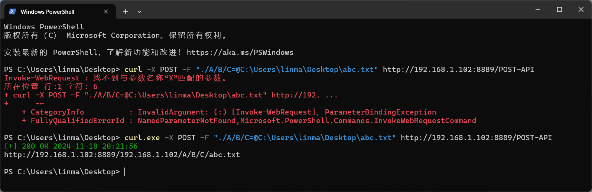
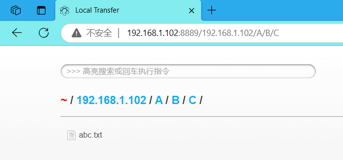
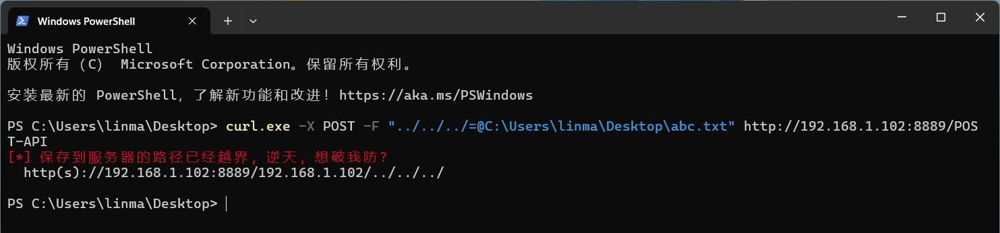
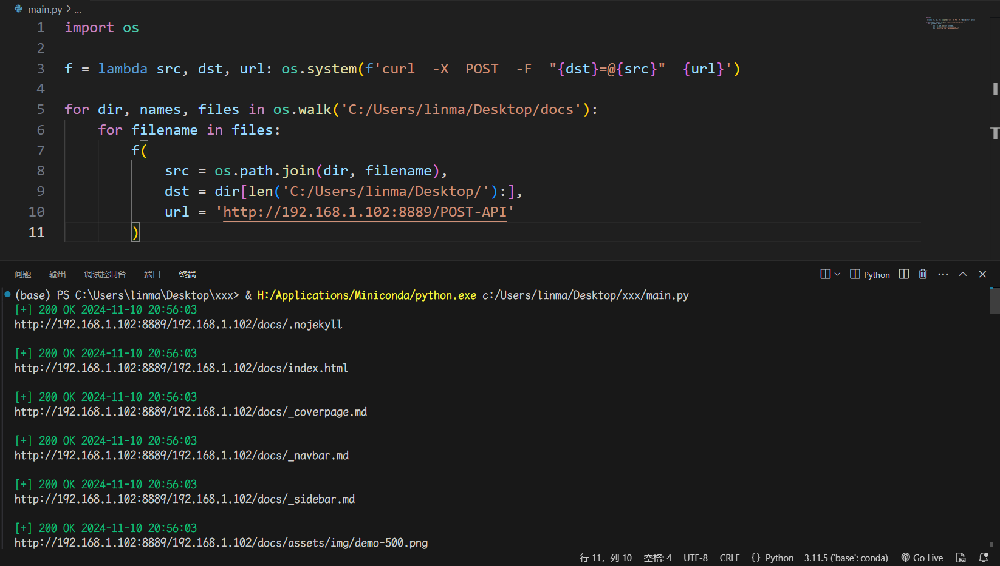
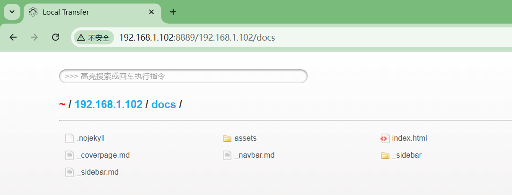

## 3.3.1. 上传一个文件

Local Transfer 支持 "`http://HOST:PORT/POST-API`" 路由，允许开发者通过 "`POST`" 请求上传文件，这样方便自动化办公。例如，使用 "`curl`" 工具，那么标准模板可以按照如下格式写：

```Bash
curl  -X  POST  -F  "[dst]=@[src]"  http://[socket]/POST-API
```

> [!TIP]
> 将本地电脑上的 "`C:\Users\linma\Desktop\abc.txt`" 上传到服务器默认位置的 "`A/B/C`" 嵌套文件夹中。
> ```Bash
> curl  -X  POST  -F  "./A/B/C=@C:/Users/linma/Desktop/abc.txt"  http://192.168.1.102:8889/POST-API
> ```

<div style="text-align: center;">
    
    
</div>

> [!WARNING]
> 同样的，如果 POST 请求服务器的路径越界，会发出危险警告！例如，保存到服务器默认位置的上两级目录：
> ```Bash
> curl  -X  POST  -F  "../../../=@C:/Users/linma/Desktop/abc.txt"  http://192.168.1.102:8889/POST-API
> ```

<div style="text-align: center;">
    
</div>

## 3.3.2. 上传多个文件

反复调用 "`curl`" 指令，这样就能实现多个文件的上传，例如：

```python
import os

os.system('curl  -X  POST  -F  ".=@C:/Users/linma/Desktop/1.png"  http://192.168.1.102:8889/POST-API')
os.system('curl  -X  POST  -F  ".=@C:/Users/linma/Desktop/2.csv"  http://192.168.1.102:8889/POST-API')
os.system('curl  -X  POST  -F  "./music=@C:/Users/linma/Desktop/3.mp3"  http://192.168.1.102:8889/POST-API')
os.system('curl  -X  POST  -F  ".=@C:/Users/linma/Desktop/4.exe"  http://192.168.1.102:8889/POST-API')
```

如果你电脑没有安装 "`curl`" 指令，也可以使用 "`Python requests`" 库发送 "`POST`" 请求。

```python
import requests

try:
    requests.post(
        url = 'http://192.168.1.102:8889/POST-API',
        files = {
            '.': open('C:/Users/linma/Desktop/1.png', mode='rb'),
            '.': open('C:/Users/linma/Desktop/2.csv', mode='rb'),
            './music': open('C:/Users/linma/Desktop/3.mp3', mode='rb'),
            '.': open('C:/Users/linma/Desktop/4.exe', mode='rb')
        }
    )
except:
    pass
```

## 3.3.3. 上传一个文件夹

既然已经了解一个文件和多个文件的上传，那么 "`POST`" 一整个文件夹也是得心应手的。

```python
import os

f = lambda src, dst, url: os.system(f'curl  -X  POST  -F  "{dst}=@{src}"  {url}')

for dir, names, files in os.walk('C:/Users/linma/Desktop/docs'):
    for filename in files:
        f(
            src = os.path.join(dir, filename),
            dst = dir[len('C:/Users/linma/Desktop/'):],
            url = 'http://192.168.1.102:8889/POST-API'
        )
```

<div style="text-align: center;">
    
    
</div>

## 3.3.4. 上传多个文件夹

反复上传整个文件夹，那么就相当于上传多个文件夹，例如：

```python
import os

f = lambda src, dst, url: os.system(f'curl  -X  POST  -F  "{dst}=@{src}"  {url}')

for dir, names, files in os.walk('C:/Users/linma/Desktop/Pictures'):
    for filename in files:
        f(
            src = os.path.join(dir, filename),
            dst = dir[len('C:/Users/linma/Desktop/'):],
            url = 'http://192.168.1.102:8889/POST-API'
        )

for dir, names, files in os.walk('C:/Users/linma/Desktop/Music'):
    for filename in files:
        f(
            src = os.path.join(dir, filename),
            dst = dir[len('C:/Users/linma/Desktop/'):],
            url = 'http://192.168.1.102:8889/POST-API'
        )

for dir, names, files in os.walk('C:/Users/linma/Desktop/Jarvis/core'):
    for filename in files:
        f(
            src = os.path.join(dir, filename),
            dst = dir[len('C:/Users/linma/Desktop/Jarvis/'):],
            url = 'http://192.168.1.102:8889/POST-API'
        )
```