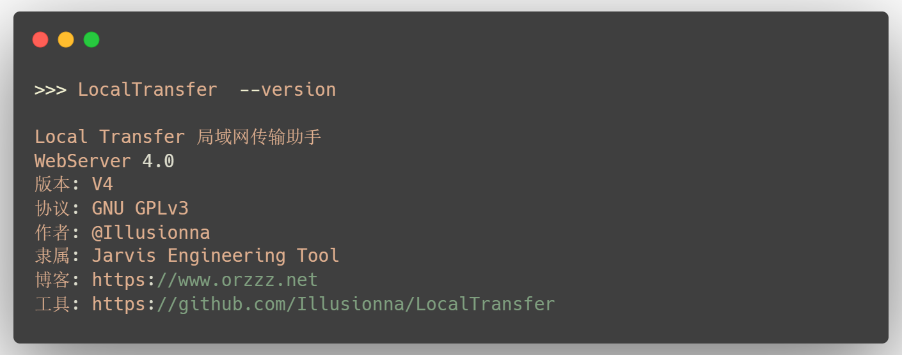

## 简介

<div style="text-align: center;">
    
</div>

## 1.1. 这是什么？

这是一个文件传输的中心化服务器组件。通俗来讲，它能够帮助你**共享文件夹**、**互传文件**以及**操作文件**。Local Transfer 具有以下特点：

> - 易于使用：便捷轻巧，一站式服务，无需任何验证、注册、登录，开箱即用；
> - 开源免费：源代码公开可用，软件不收取任何费用；
> - 中心化跨平台：既可以在个人电脑上使用，又可以在服务器上使用，支持 **Windows**、Linux、macOS 操作系统；
> - 高度自由：支持局域网传输，也支持互联网传输，更支持你的自定义操作。

**在线体验【如有国外代理，建议关闭】**：http://124.70.191.21:8888

Bilibili 视频教学：https://www.bilibili.com/video/BV1MaDuY6EDJ

GitHub 源码仓库：https://github.com/Illusionna/LocalTransfer

## 1.2. 怎么去下载软件？

如果你的电脑或服务器是 Windows 10、Windows 11 版本，可以**直接下载** `.exe` 程序；如果你的电脑是 Linux 或 macOS 版本，请下载相应版本的 .zip 源代码压缩包；如果你电脑是古老的 Windows 7 版本，下载 GitHub 源码仓库的 "src" 文件夹。

> [!TIP]
> 无论是 Windows，还是 Linux，或者 macOS，你都可以下载 "`src`" 源码。
> ```Bash, PowerShell
> git clone https://github.com/Illusionna/LocalTransfer.git
> cd ./src
> ```

> GitHub 发行版：https://github.com/Illusionna/LocalTransfer/releases
>
> 百度网盘：https://pan.baidu.com/s/1Lhrg5p78UlMaiDqnPjGzjg?pwd=7s3g
>
> QQ 群文件：728832589

## 1.3. 一些答疑

> Q：只能在局域网（同一个 WIFI 或热点）下使用么？
>
> A：既可以在局域网内使用，也可以在公网、互联网上使用。局域网内使用是零门槛的，不过，局域网不能有 AP 隔离，此外，公网使用需要一定网络基础，最后公网的效果见 http://124.70.191.21:8888 所示。

> Q：会消耗流量么？
>
> A：局域网内不耗流量，公网会消耗流量。

> Q：软件磁盘占用空间，以及运行时内存占用大么？会产生冗余的垃圾数据不？
>
> A：磁盘占用空间极小，Windows 版本的 .exe 程序仅 10MB，源码压缩包也仅 3MB；运行时内存占用也很小，Windows 约 40MB，Linux 和 macOS 都约 30MB；不会产生任何冗余数据，前提是你需要清晰知晓上传文件所保存在的目录 ：）

> Q：文件上传、下载速度快么？
>
> A：速度取决于路由器、网络带宽等，Local Transfer 不会限制传输速度。

> Q：工具安全吗？
>
> A：采取 HTTP 协议，没有 SSL/TLS 加密，不安全，别用 (づ｡◕‿‿◕｡)づ【开玩笑啦，不过建议在你完成传输后即时关闭程序】

> Q：会不会更新太快，导致版本不兼容？
>
> A：就自己随便做的小玩意，有精力就更新，没精力就摆烂，确保下载最新版本即可。

<div style="text-align: center;">
    
</div>
