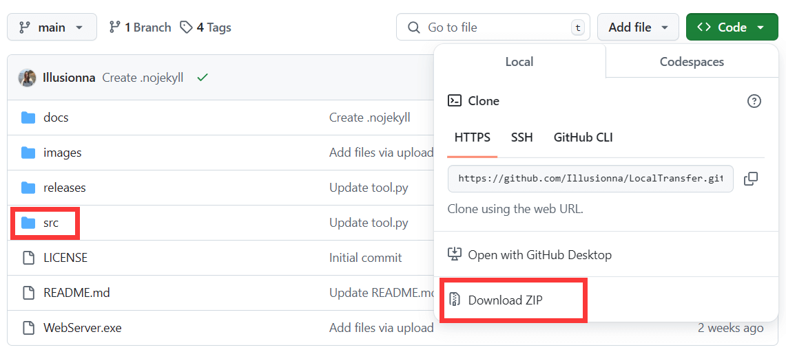

Windows 7 以及 Linux 和 macOS 的发行版都是源码，因此需要依赖 `Python` 编程环境。

Python 版本要求至少高于 3.7.0，如果你的电脑已经安装了 conda 环境，可执行：

> [!WARNING|label:Important]
> ```CMD
> conda create -n aaaaa python==3.7.0
> conda activate aaaaa
> ```

> [!TIP]
> 无论是 Windows，还是 Linux，或者 macOS，你都可以下载 "`src`" 源码。
> ```CMD
> git clone https://github.com/Illusionna/LocalTransfer.git
> cd src
> ```

你也可以去 GitHub 源码主页下载 .zip 压缩包，解压完成后进入 "`src`" 文件夹的工作区目录。

<div style="text-align: center;">
    
</div>

直接执行 "`src`" 目录下的 "`main.py`" 文件即可启动服务：

> ```CMD
> python  main.py
> ```