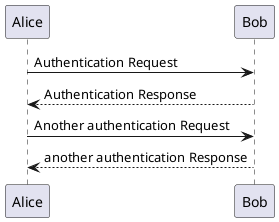
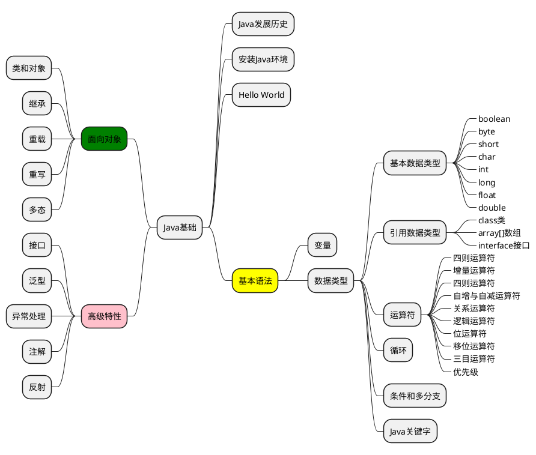

# 一级标题


主题色已经修改`#627d99`


**你干嘛~~~**

*哎呦~~~*


`blablablabla`

## 二级标题
> 鸡你太美

测试latex渲染 $\LaTeX$
$$
y = \sum_{i=1}^100 x_i
$$
行内公式: $y = x^2 + 1$


### 三级标题
第一次鸭变成这样的我

```
不管我怎么去否认~~~
```

#### 四级标题
```python
# python代码块

print("Hello World!")

```


[korki.io](https://kroki.io)


测试mermiad渲染


测试plantuml渲染

测试plantuml渲染思维导图



